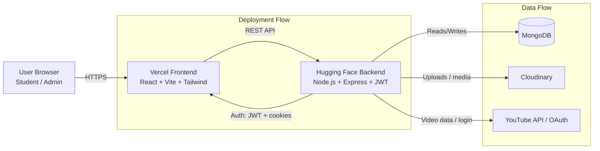

                ┌──────────────────────────┐
                │        User Browser      │
                │   (React Frontend UI)    │
                └────────────┬─────────────┘
                             │
                             │ HTTPS / API calls
                             ▼
                ┌──────────────────────────┐
                │     Vercel Frontend      │
                │   React + Vite + Tailwind│
                └────────────┬─────────────┘
                             │
                             │ REST API
                             ▼
                ┌──────────────────────────┐
                │   Hugging Face Backend   │
                │ Node.js + Express + JWT  │
                └───────┬────────┬─────────┘
                        │        │
                        │        │
                        ▼        ▼
           ┌────────────────┐  ┌──────────────────┐
           │   MongoDB      │  │ External Services │
           │   Database     │  │ Cloudinary, YouTube│
           └────────────────┘  └──────────────────┘


           flowchart LR
    U[User Browser] --> F[Vercel Frontend<br/>React + Vite + Tailwind]
    F --> B[Hugging Face Backend<br/>Node.js + Express + JWT]
    B --> DB[MongoDB]
    B --> EXT[Cloudinary / YouTube API / OAuth]


    ## E-GurukulX Architecture

```text
┌──────────────────────┐
│    User Browser      │
│  Student / Admin     │
└──────────┬───────────┘
                   │ HTTPS
                   ▼
┌──────────────────────┐        Auth flow
│  Vercel Frontend     │<--------------------┐
│ React + Vite + UI    │                     │
└──────────┬───────────┘                     │
                   │ REST API                        │ JWT / cookies
                   ▼                                 │
┌──────────────────────┐                     │
│ Hugging Face Backend │---------------------┘
│ Node + Express + API │
└───────┬───────┬──────┘
                │       │
                │       ├──────────────► Cloudinary
                │       │               (uploads/media)
                │       │
                │       └──────────────► YouTube / OAuth
                │                       (video data, login)
                ▼
┌──────────────────────┐
│      MongoDB         │
│ users, notes,        │
│ playlists, progress  │
└──────────────────────┘
```



### How to explain it in interview

- The user opens the app in the browser, and the frontend is hosted on Vercel.
- The frontend sends API requests to the backend on Hugging Face.
- The backend handles authentication, business logic, and database operations.
- MongoDB stores user, note, playlist, contest, and progress data.
- Cloudinary handles uploads, while YouTube and OAuth provide media and login integration.
- JWT and cookies manage secure auth between frontend and backend.